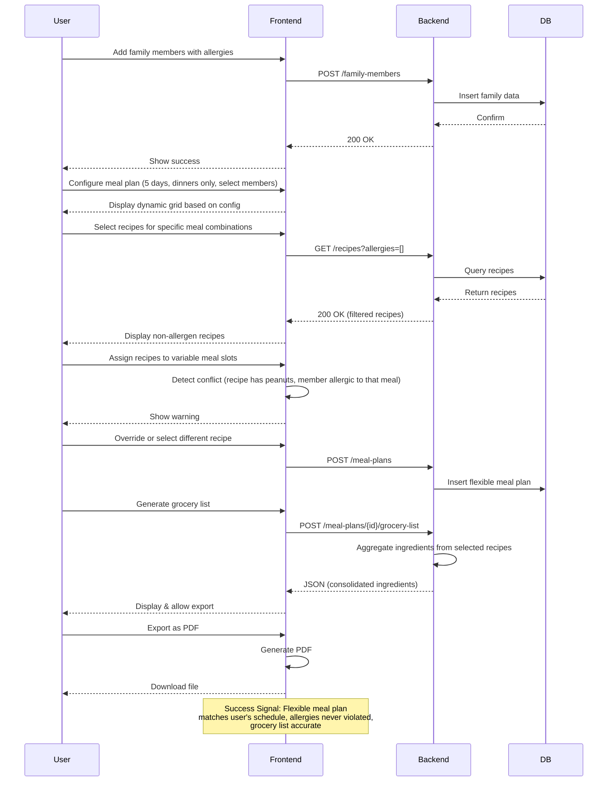

# Family Recipe Planner - Task Breakdown

**Last Updated**: 2026-05-10

## 1. Objective & Deliverables

### Overall Objective
Build a web application that allows families to plan weekly meals (breakfast, lunch, dinner) for multiple family members with different food preferences and allergies, then auto-generate a grocery list.

### Key Deliverables
1. **Web Application** – Responsive UI for meal planning
2. **Recipe Database** – Recipes with ingredients, allergies, and dietary tags
3. **Family Profile Management** – Define family members with preferences and allergies
4. **Weekly Meal Planner** – UI to assign recipes to family members for each meal/day
5. **Grocery List Generator** – Aggregate ingredients from selected recipes with quantity consolidation
6. **Print Interface** – Generate printable recipe cards and grocery list
7. **Data Persistence** – Store recipes, family profiles, and meal plans

---

## 2. Work Hierarchy Breakdown

### Body of Work: Family Recipe Planner Application

#### Feature 1: Family Profile Management
- **Task 1.1**: Create family member data model (name, allergies, preferences, dietary restrictions)
- **Task 1.2**: Build UI form to add/edit family members
- **Task 1.3**: Add allergy/preference tagging system
- **Task 1.4**: Persist family profiles to local storage or database
- **Work Item 1.4.1**: Create migration for family profile schema
- **Work Item 1.4.2**: Implement CRUD endpoints for family members

#### Feature 2: Recipe Management
- **Task 2.1**: Design recipe data model (name, ingredients, instructions, allergies, prep time, dietary tags)
- **Task 2.2**: Build recipe database using Ollama for local generation
  - **Work Item 2.2.1**: Create recipe generation prompt template (JSON structure: name, ingredients with units, instructions, prep time, allergies, dietary tags, serves)
  - **Work Item 2.2.2**: Implement Ollama API client to batch-generate 50+ seed recipes
  - **Work Item 2.2.3**: Validate generated recipes (schema compliance, quality checks) and store to database
  - **Work Item 2.2.4**: Create admin CLI tool to regenerate/refresh recipes on-demand
- **Task 2.3**: Create recipe card UI component
- **Task 2.4**: Implement recipe filtering by allergies and preferences
- **Work Item 2.4.1**: Add search/filter UI
- **Work Item 2.4.2**: Implement server-side filtering logic

#### Feature 3: Weekly Meal Planner
- **Task 3.1**: Design flexible meal plan data model
  - **Work Item 3.1.1**: Create configurable meal plan template (select days: 1-7, select meal types per day, select family members per meal)
  - **Work Item 3.1.2**: Design data structure to support variable meal schedules (e.g., Monday has breakfast + dinner for 4 people, Tuesday has lunch for 3 people, etc.)
- **Task 3.2**: Build dynamic calendar/grid UI for meal assignment
  - **Work Item 3.2.1**: Create UI to configure meal plan scope (days, meals, members) before planning
  - **Work Item 3.2.2**: Generate responsive grid based on selected configuration
- **Task 3.3**: Implement drag-and-drop or dropdown recipe selection
- **Task 3.4**: Add conflict detection (recipe violates member's allergies)
- **Task 3.5**: Persist meal plans to database
- **Work Item 3.5.1**: Create flexible meal plan schema
- **Work Item 3.5.2**: Implement meal plan CRUD endpoints

#### Feature 4: Grocery List Generation
- **Task 4.1**: Implement ingredient aggregation logic (combine all recipes in meal plan)
- **Task 4.2**: Consolidate duplicate ingredients and sum quantities
- **Task 4.3**: Add grocery list UI with categorization (produce, dairy, meat, etc.)
- **Task 4.4**: Allow manual editing of grocery list (add/remove/modify quantities)
- **Task 4.5**: Implement export to common formats (CSV, PDF, plain text)

#### Feature 5: Print & Export
- **Task 5.1**: Design printable recipe card template
- **Task 5.2**: Design printable grocery list template
- **Task 5.3**: Implement print-to-PDF functionality
- **Task 5.4**: Add print styles for responsive layout
- **Work Item 5.4.1**: Create CSS print media queries

#### Feature 6: Core Infrastructure
- **Task 6.1**: Set up project scaffolding (frontend + backend)
- **Task 6.2**: Configure database and migrations
- **Task 6.3**: Set up authentication (optional: basic login, or start with no auth)
- **Task 6.4**: Implement error handling and logging
- **Task 6.5**: Configure deployment pipeline (staging and production)

#### Feature 7: Meal Feedback & Preferences
- **Task 7.1**: Design feedback data model (recipe ID, meal date, family member, liked/disliked, optional notes)
- **Task 7.2**: Build UI to rate meals after eating (thumbs up/down or like/dislike)
- **Task 7.3**: Store feedback to database with default assumption (no feedback = liked)
- **Task 7.4**: Create admin view to see meal ratings and family preferences over time
- **Task 7.5**: Integrate feedback into recipe filtering (optionally hide frequently disliked recipes from future suggestions)
- **Task 7.6**: Analytics dashboard showing most/least popular recipes by family member

---

## 3. Prioritization

### High Priority (Critical Path)
1. **Feature 6**: Core Infrastructure – blocks all other features
2. **Feature 1**: Family Profile Management – needed before meal planning
3. **Feature 2**: Recipe Management – needed before meal planning
4. **Feature 3**: Weekly Meal Planner – core feature, high user impact
5. **Feature 4**: Grocery List Generation – primary value proposition

### Medium Priority
6. **Feature 5**: Print & Export – enhances usability but not blocking
7. **Feature 7**: Meal Feedback & Preferences – improves recommendations, nice-to-have for MVP

### Implementation Order
1. Weeks 1-2: Feature 6 (infrastructure) + Feature 1 (family profiles)
2. Weeks 2-3: Feature 2 (recipes) + start Feature 3 (planner)
3. Weeks 3-4: Complete Feature 3 + Feature 4 (grocery list)
4. Weeks 4-5: Feature 5 (print/export) + polish & QA
5. Weeks 5-6+: Feature 7 (feedback & learning) – post-MVP enhancement

---

## 4. Testing Strategy

### Overview
Testing is organized by pyramid: Unit Tests (base) → Component/Integration Tests (middle) → E2E Tests (top). Each work item has specific test requirements that build upward.

### Testing Tools & Frameworks
- **Frontend**: Vanilla JS testing or Playwright/Cypress for browser flows
- **Backend**: RSpec + Rails request/model specs
- **E2E**: Playwright or Cypress
- **Database**: Use PostgreSQL with Rails migrations and test database
- **Load Testing**: k6 or Apache JMeter (optional, post-MVP)

---

### Feature 1: Family Profile Management

#### Task 1.1: Family Member Data Model
**Unit Tests:**
- `test_family_member_creation_with_required_fields()` – name, allergies, preferences set correctly
- `test_family_member_handles_empty_allergies_list()` – no allergies should be valid
- `test_family_member_handles_multiple_allergies()` – 5+ allergies stored correctly
- `test_family_member_handles_dietary_restrictions()` – vegan, vegetarian, gluten-free, and personal preferences (e.g., no onions) stored and retrieved
- `test_family_member_validates_name_not_empty()` – reject creation without name
- `test_family_member_serialization_to_json()` – converts to/from JSON for storage

#### Task 1.2: UI Form (Add/Edit Family Members)
**Component Tests:**
- `test_add_member_form_renders()` – form loads with all fields
- `test_form_validation_requires_name()` – error shown if name empty
- `test_form_validation_requires_at_least_one_identifier()` – name or ID required
- `test_allergy_checkbox_selection()` – select/deselect allergies, state updates
- `test_preference_tags_can_be_added_and_removed()` – dynamic tag input works
- `test_submit_button_disabled_until_form_valid()` – UX flow
- `test_form_populates_correctly_when_editing_existing_member()` – load member data into form
- `test_form_clears_on_successful_submission()` – ready for next entry
- `test_form_shows_error_message_on_backend_failure()` – graceful error handling

#### Task 1.3: Allergy/Preference Tagging System
**Unit Tests:**
- `test_allergy_tag_creation_with_valid_name()` – "peanut", "gluten" stored
- `test_allergy_tag_duplicate_prevention()` – can't create "peanut" twice
- `test_preference_tag_creation()` – "vegetarian", "low-sodium" tags work
- `test_tag_normalization()` – "Peanut" and "peanut" treated as same
- `test_tag_storage_and_retrieval()` – tags persist

**Component Tests:**
- `test_allergy_tag_autocomplete()` – dropdown suggests existing allergies
- `test_custom_tag_creation_in_form()` – user can add new allergy if not in list
- `test_tag_removal_with_x_button()` – clicking X removes tag

#### Task 1.4: Persistence (Database Schema & CRUD Endpoints)
**Work Item 1.4.1: DB Schema**
**Unit Tests:**
- `test_migration_creates_family_members_table()` – table exists with correct columns
- `test_migration_creates_allergies_table()` – junction table for many-to-many relationship
- `test_migration_creates_preferences_table()` – table for dietary preferences
- `test_schema_enforces_required_fields()` – NOT NULL constraints on name
- `test_migration_rollback_and_forward()` – migrations are reversible

**Work Item 1.4.2: CRUD Endpoints**
**Unit Tests:**
- `test_create_family_member_returns_201_and_id()` – POST /family-members
- `test_read_family_member_by_id()` – GET /family-members/{id}
- `test_read_all_family_members()` – GET /family-members
- `test_update_family_member_allergies()` – PUT /family-members/{id}
- `test_delete_family_member_removes_from_db()` – DELETE /family-members/{id}
- `test_api_validation_rejects_invalid_input()` – missing fields, invalid types
- `test_api_returns_404_for_nonexistent_member()` – proper error handling

**Integration Tests:**
- `test_create_member_and_retrieve_with_allergies()` – full round-trip: create → read back
- `test_update_member_allergies_persists()` – allergies update correctly
- `test_delete_member_cascades_to_meal_plans()` – orphan handling

**Definition of Done:** All tests pass, 90%+ code coverage, no console errors/warnings

---

### Feature 2: Recipe Management

#### Task 2.1: Recipe Data Model
**Unit Tests:**
- `test_recipe_creation_with_all_fields()` – name, ingredients, instructions, allergies, prep time, dietary tags
- `test_recipe_validates_required_fields()` – name and ingredients required
- `test_ingredient_structure_with_quantity_and_unit()` – {name, quantity, unit, allergens}
- `test_ingredient_units_flexibility()` – "cups", "grams", "ml", "tbsp" handled
- `test_recipe_handles_multiple_allergies()` – "peanuts, dairy, soy" stored separately
- `test_recipe_dietary_tags()` – "gluten-free", "vegan", "low-sodium" assigned
- `test_recipe_prep_time_in_minutes()` – stored as integer
- `test_recipe_serves_count()` – serves 2, 4, 6 people
- `test_recipe_serialization_to_json()` – for storage/API

#### Task 2.2: Ollama Recipe Generation
**Work Item 2.2.1: Recipe Generation Prompt**
**Unit Tests:**
- `test_prompt_template_generates_valid_json_structure()` – output matches schema
- `test_prompt_includes_all_required_fields()` – name, ingredients, instructions, allergies, tags
- `test_prompt_requests_metric_and_imperial_units()` – variety in measurements
- `test_prompt_requests_diverse_cuisine_types()` – not all the same style

**Work Item 2.2.2: Ollama API Client**
**Unit Tests:**
- `test_ollama_client_initialization()` – connects to local Ollama
- `test_ollama_client_generates_recipe_json()` – calls generate, gets response
- `test_ollama_client_retries_on_timeout()` – handles slow LLM
- `test_ollama_client_parses_json_output()` – extracts JSON from markdown/text wrapper
- `test_ollama_client_handles_malformed_json()` – graceful fallback if LLM breaks JSON

**Integration Tests:**
- `test_batch_generate_50_recipes()` – generates 50 recipes without errors
- `test_generated_recipes_have_unique_names()` – no duplicates
- `test_generated_recipes_have_realistic_ingredient_quantities()` – not all "1 cup" or "0 grams"

**Work Item 2.2.3: Validation & Storage**
**Unit Tests:**
- `test_recipe_validator_checks_required_fields()` – rejects incomplete recipes
- `test_recipe_validator_checks_ingredient_quantities_nonzero()` – rejects "0 cups"
- `test_recipe_validator_checks_instructions_not_empty()` – rejects blank instructions
- `test_recipe_storage_to_database()` – insert recipe record
- `test_recipe_retrieval_from_database()` – read back matches inserted

**Integration Tests:**
- `test_full_generation_validation_storage_flow()` – generate → validate → store
- `test_duplicate_recipe_detection()` – same name/ingredients not stored twice

**Work Item 2.2.4: Admin CLI Tool**
**Unit Tests:**
- `test_cli_accepts_count_parameter()` – `generate-recipes --count=100`
- `test_cli_accepts_model_parameter()` – `--model=mistral` vs `--model=llama2`
- `test_cli_shows_progress_bar_during_generation()`
- `test_cli_reports_success_failure_counts()` – "Generated 98/100 successfully"
- `test_cli_can_overwrite_existing_recipes()` – flag to replace or skip

#### Task 2.3: Recipe Card UI Component
**Component Tests:**
- `test_recipe_card_renders_with_all_data()` – name, ingredients, instructions visible
- `test_recipe_card_displays_allergies_as_tags()` – "peanuts", "dairy" shown as colored badges
- `test_recipe_card_displays_dietary_tags()` – "vegan", "gluten-free" shown
- `test_recipe_card_displays_prep_time()` – "30 min", "45 min" shown
- `test_recipe_card_displays_serves_count()` – "Serves 4"
- `test_recipe_card_expandable_instructions()` – instructions visible or collapsible
- `test_recipe_card_responsive_on_mobile()` – works on small screens
- `test_recipe_card_copy_to_clipboard_button()` – ingredients list can be copied

#### Task 2.4: Recipe Filtering
**Work Item 2.4.1: Search/Filter UI**
**Component Tests:**
- `test_search_input_filters_by_recipe_name()` – type "chicken" → shows chicken recipes
- `test_allergy_filter_multiselect()` – select "peanut-free" and "dairy-free" together
- `test_dietary_filter_buttons()` – toggle "vegan", "gluten-free", etc.
- `test_prep_time_range_slider()` – filter 0-30 min, 30-60 min, 60+ min
- `test_filter_results_update_in_realtime()` – no submit button needed
- `test_clear_all_filters_button()` – reset all filters at once
- `test_filter_combination_logic()` – "vegan AND gluten-free AND under 30 min"

**Work Item 2.4.2: Server-Side Filtering**
**Unit Tests:**
- `test_filter_recipes_by_single_allergy()` – GET /recipes?exclude_allergen=peanut
- `test_filter_recipes_by_multiple_allergies()` – ?exclude_allergen=peanut&exclude_allergen=dairy
- `test_filter_recipes_by_dietary_tag()` – ?tag=vegan
- `test_filter_recipes_by_prep_time_range()` – ?max_prep_time=30
- `test_filter_recipes_by_name_substring()` – ?search=chicken
- `test_filter_combination_all_params()` – all filters together
- `test_filter_returns_empty_if_no_matches()` – graceful empty result

**Integration Tests:**
- `test_search_filter_ui_calls_backend_correctly()` – frontend → backend call
- `test_backend_returns_filtered_recipes_to_frontend()` – end-to-end search flow
- `test_recipe_filter_respects_all_family_allergies()` – given member with peanut allergy, no recipes with peanuts returned
- `test_recipe_filter_respects_all_family_preferences()` – given member dislikes onions, no recipes with onions returned
- `test_recipe_filter_with_multiple_members_and_constraints()` – given 5 people with mixed allergies/preferences, only recipes safe for all returned

**Definition of Done:** All tests pass, recipes generated and filtered, 85%+ coverage on generation logic

---

### Feature 3: Weekly Meal Planner

#### Task 3.1: Flexible Meal Plan Data Model
**Work Item 3.1.1: Configurable Template**
**Unit Tests:**
- `test_meal_plan_config_accepts_day_count()` – 1-7 days valid
- `test_meal_plan_config_accepts_meal_types()` – breakfast, lunch, dinner individually selectable
- `test_meal_plan_config_accepts_family_member_selection()` – select subset of family
- `test_meal_plan_config_serialization()` – config saved as JSON
- `test_meal_plan_config_validation()` – rejects invalid day count, empty members

**Work Item 3.1.2: Flexible Data Structure**
**Unit Tests:**
- `test_meal_slot_creation()` – {day, meal_type, family_members, recipe_id, date}
- `test_meal_slot_handles_variable_member_counts()` – 1 person, 3 people, all 5 people per slot
- `test_meal_plan_respects_config()` – only creates slots for selected days/meals
- `test_meal_slot_conflict_detection()` – same person can't have 2 recipes for same slot
- `test_meal_plan_handles_dietary_overlap()` – member with allergen assigned to recipe with allergen detects

#### Task 3.2: Dynamic Calendar/Grid UI
**Work Item 3.2.1: Configuration UI**
**Component Tests:**
- `test_day_range_picker()` – select 3-7 days with calendar
- `test_meal_type_checkboxes()` – check breakfast, lunch, dinner independently
- `test_family_member_multiselect()` – pick which members apply
- `test_preview_grid_updates_as_config_changes()` – real-time preview
- `test_config_submit_creates_empty_grid()` – clicking "Create Plan" generates grid

**Work Item 3.2.2: Dynamic Grid Rendering**
**Component Tests:**
- `test_grid_renders_correct_number_of_rows()` – 5 days = 5 rows if daily
- `test_grid_renders_correct_number_of_columns()` – 2 meals = 2 columns
- `test_grid_shows_member_names_in_headers()` – "Alice", "Bob" shown
- `test_grid_cell_shows_assigned_recipe()` – recipe name displayed
- `test_grid_empty_cells_show_placeholder()` – "No recipe assigned"
- `test_grid_responsive_on_mobile()` – scrollable on small screens

#### Task 3.3: Recipe Selection (Drag-Drop / Dropdown)
**Component Tests:**
- `test_recipe_dropdown_shows_filtered_recipes()` – recipes matching allergies only
- `test_recipe_selection_updates_grid_cell()` – click recipe → updates cell
- `test_drag_and_drop_recipe_to_cell()` – if implemented
- `test_recipe_deselection_clears_cell()` – remove assigned recipe
- `test_recipe_suggestion_hints()` – show related recipes or popular ones

#### Task 3.4: Conflict Detection
**Unit Tests:**
- `test_detect_allergen_conflict()` – recipe has peanuts, member allergic to peanuts
- `test_conflict_detection_returns_affected_member()` – report which member has conflict
- `test_no_conflict_if_no_allergen_match()` – healthy recipes pass through
- `test_conflict_across_multiple_members()` – detect conflicts for each member independently

**Component Tests:**
- `test_conflict_warning_shows_on_selection()` – visual warning before/after assigning
- `test_conflict_warning_shows_member_name_and_allergen()` – "Bob is allergic to peanuts in this recipe"
- `test_override_button_allows_deliberate_assignment()` – confirm action if intentional (e.g., allergic person won't eat)
- `test_conflict_history_prevents_accidental_override()` – require confirmation

#### Task 3.5: Persistence
**Work Item 3.5.1: Flexible Meal Plan Schema**
**Unit Tests:**
- `test_migration_creates_meal_plans_table()` – plan metadata (config, created_date)
- `test_migration_creates_meal_slots_table()` – individual meal assignments
- `test_schema_references_recipes_and_family_members()` – foreign keys
- `test_schema_supports_variable_slot_counts()` – no hard 7×3 limit

**Work Item 3.5.2: Meal Plan CRUD Endpoints**
**Unit Tests:**
- `test_create_meal_plan_with_config()` – POST /meal-plans {config: {...}}
- `test_get_meal_plan_by_id()` – GET /meal-plans/{id} returns config + slots
- `test_update_meal_slot_recipe()` – PATCH /meal-plans/{id}/slots/{slot_id} {recipe_id}
- `test_delete_meal_plan()` – DELETE /meal-plans/{id}
- `test_list_all_meal_plans_for_family()` – GET /meal-plans

**Integration Tests:**
- `test_create_config_saves_and_retrieves()` – round-trip config
- `test_update_recipe_in_slot_persists()` – modify plan, reload, change still there
- `test_delete_plan_removes_all_slots()` – cascade deletion

**E2E Tests:**
- `test_full_flow_configure_plan_assign_recipes_save()` – user creates 5-day dinner plan, assigns recipes, saves
- `test_full_flow_load_existing_plan_modify_save()` – load previous plan, change one recipe, save
- `test_full_flow_plan_with_conflicts_shows_warnings()` – create plan with allergen conflicts, verify UI warns

**Definition of Done:** Dynamic grid rendering, conflict detection, save/load working, E2E tests passing

---

### Feature 4: Grocery List Generation

#### Task 4.1: Ingredient Aggregation Logic
**Unit Tests:**
- `test_aggregate_ingredients_from_single_recipe()` – 1 recipe → all ingredients listed
- `test_aggregate_ingredients_from_multiple_recipes()` – 5 recipes → combined list
- `test_preserve_ingredient_names_and_units()` – "2 cups flour" stays as is
- `test_handle_missing_ingredient_data_gracefully()` – recipe missing unit doesn't crash
- `test_aggregate_respects_member_count()` – if recipe serves 2, adjust for 4 people (double ingredients)

#### Task 4.2: Consolidation & Quantity Summing
**Unit Tests:**
- `test_consolidate_duplicate_ingredients_by_name()` – "flour" appears 3x → 1 line, summed qty
- `test_sum_quantities_with_same_unit()` – 2 cups + 3 cups = 5 cups
- `test_handle_mixed_units_for_same_ingredient()` – "2 cups flour" + "200g flour" → convert or note both
- `test_consolidation_preserves_allergen_tags()` – combined flour still tagged "gluten"
- `test_consolidation_handles_optional_ingredients()` – mark "optional" vs "required"
- `test_consolidation_groups_by_ingredient_type()` – produce separate from dairy

#### Task 4.3: Grocery List UI & Categorization
**Component Tests:**
- `test_grocery_list_displays_all_aggregated_ingredients()` – every ingredient shown
- `test_grocery_list_groups_by_category()` – Produce, Dairy, Meat, Pantry, Spices
- `test_category_collapsible_sections()` – expand/collapse each category
- `test_ingredient_line_item_shows_name_quantity_unit()` – "2 cups flour"
- `test_ingredient_line_item_shows_allergen_badge()` – "dairy" icon/tag
- `test_ingredient_checkbox_for_shopping()` – mark items as "bought"
- `test_checked_items_visual_strikethrough()` – UX feedback
- `test_grocery_list_responsive_and_printable_layout()` – fits on mobile and paper

#### Task 4.4: Manual Editing
**Component Tests:**
- `test_edit_ingredient_quantity()` – click quantity → edit field → save
- `test_add_new_ingredient_to_list()` – user adds "milk" or "extra salt"
- `test_remove_ingredient_from_list()` – delete button removes item
- `test_undo_last_edit()` – undo button restores previous state
- `test_reorder_ingredients_drag_drop()` – drag ingredient to new position

#### Task 4.5: Export Formats (CSV, PDF, Text)
**Unit Tests:**
- `test_export_to_csv_format()` – proper CSV headers, rows, escaping
- `test_export_to_pdf_includes_all_ingredients()` – PDF has every item
- `test_export_to_plaintext_readable_format()` – simple text version
- `test_export_filename_includes_date()` – "grocery_list_2026-05-10.csv"

**Component Tests:**
- `test_export_buttons_visible()` – CSV, PDF, Text download buttons
- `test_export_dialog_allows_format_selection()` – user picks format
- `test_export_triggers_file_download()` – file actually downloads

**Integration Tests:**
- `test_full_flow_meal_plan_to_grocery_list_to_export()` – create plan → generate list → export PDF

**Definition of Done:** Consolidation logic accurate, UI functional, exports work in all browsers

---

### Feature 5: Print & Export

#### Task 5.1-5.4: Print Templates & Styles
**Component Tests:**
- `test_recipe_card_print_template_includes_all_info()` – name, ingredients, instructions, allergens
- `test_recipe_card_print_breaks_properly_across_pages()` – no mid-recipe breaks
- `test_grocery_list_print_template_organized_by_category()` – groups maintained
- `test_grocery_list_includes_checkboxes_for_printing()` – print-friendly format
- `test_print_styles_hide_ui_controls()` – buttons, navigation hidden in print
- `test_print_optimized_for_a4_and_letter_paper()` – page breaks correct
- `test_print_generates_valid_pdf_chrome()` – PDF exports from Chrome
- `test_print_generates_valid_pdf_firefox()` – PDF exports from Firefox
- `test_print_generates_valid_pdf_safari()` – PDF exports from Safari

**E2E Tests:**
- `test_user_can_print_to_physical_printer()` – print dialog appears
- `test_user_can_save_as_pdf()` – "Save as PDF" option works

**Definition of Done:** Printable templates clean, PDF exports work, E2E print flow tested

---

### Feature 6: Core Infrastructure

#### Task 6.1-6.5: Setup & Config
**Unit Tests:**
- `test_database_connection_string_valid()` – connects to test DB
- `test_migration_system_working()` – `migrate up/down` works
- `test_error_logging_captures_exceptions()` – errors logged to file/console
- `test_cors_configured_for_frontend_origin()` – API allows requests
- `test_environment_variables_loaded()` – .env file parsed

**Integration Tests:**
- `test_full_backend_startup()` – server starts without errors
- `test_frontend_and_backend_communicate()` – API call succeeds
- `test_database_seeding_works()` – migrations run, tables populated

**Definition of Done:** Infrastructure stable, all systems communicating, logging functional

---

### Feature 7: Meal Feedback & Preferences

#### Task 7.1: Feedback Data Model
**Unit Tests:**
- `test_feedback_record_creation()` – {recipe_id, meal_date, member_id, liked/disliked, notes}
- `test_feedback_assumes_liked_if_no_record()` – default logic
- `test_feedback_optional_notes_field()` – "too salty", "kids loved it" stored
- `test_feedback_serialization()` – save/load from DB

#### Task 7.2: Post-Meal Rating UI
**Component Tests:**
- `test_rating_form_appears_after_meal_date()` – triggered after meal day
- `test_like_dislike_button_states()` – two buttons, one selected
- `test_optional_notes_textarea()` – comment input field
- `test_rating_submit_button_sends_feedback()` – POST /feedback

#### Task 7.3: Feedback Storage
**Unit Tests:**
- `test_store_feedback_to_database()` – insert record
- `test_retrieve_feedback_for_recipe()` – GET /recipes/{id}/feedback
- `test_retrieve_feedback_per_member()` – GET /members/{id}/feedback

#### Task 7.4: Analytics View
**Component Tests:**
- `test_analytics_dashboard_displays_recipe_ratings()` – % liked, % disliked
- `test_analytics_shows_per_member_preferences()` – "Alice likes chicken 90%"
- `test_analytics_shows_trending_recipes()` – "Most popular this month"
- `test_analytics_shows_recipes_to_avoid()` – "Disliked by: Bob, Carol"

**Unit Tests:**
- `test_calculate_recipe_like_percentage()` – (liked_count / total_feedback) × 100
- `test_calculate_member_preference_score()` – per member, per recipe

#### Task 7.5: Feedback Integration into Recipe Filtering
**Unit Tests:**
- `test_filter_recipes_by_member_preferences()` – show recipes member likes
- `test_hide_frequently_disliked_recipes()` – if <30% liked, optionally hide

#### Task 7.6: Analytics Dashboard
**Component Tests:**
- `test_dashboard_renders_all_charts()` – popularity, trends, member preferences
- `test_dashboard_responsive_on_mobile()` – charts readable on small screens
- `test_dashboard_allows_date_range_filtering()` – "last 4 weeks", "last 3 months"

**Definition of Done:** Feedback collected, analytics accurate, recommendations improving

---

### Testing Execution Order
1. **Phase 1** (Weeks 1-2): Unit tests for all data models (Features 1-2, Tasks 1.1, 2.1)
2. **Phase 2** (Weeks 2-3): Component tests for UI forms & displays (Tasks 1.2-1.3, 2.3-2.4)
3. **Phase 3** (Weeks 3-4): Integration tests for database & API (Tasks 1.4, 3.5, 4.2)
4. **Phase 4** (Weeks 4-5): E2E tests for full workflows (Features 3, 4, 5)
5. **Phase 5** (Weeks 5-6): Analytics & feedback tests (Feature 7)

### Test Coverage Targets
- **Core Logic** (aggregation, conflict detection, filtering): 95%+
- **API Endpoints**: 90%+
- **UI Components**: 80%+
- **Overall**: 85%+

### Continuous Testing & CI/CD Pipeline

#### Automated Test Execution
- **Pre-commit**: Unit tests run locally (developer machine) before push
- **On Push**: Commit hooks trigger unit tests; block push if any fail
- **On PR**: Full unit + integration test suite runs; PR blocked if coverage drops below targets
- **Nightly**: Full E2E test suite + load tests + performance benchmarks
- **Deployment Gates**: All tests must pass before staging/production deployment

#### Coverage Targets & Monitoring
- **Core Logic** (aggregation, conflict detection, filtering): 95%+
- **API Endpoints**: 90%+
- **UI Components**: 80%+
- **Overall**: 85%+
- Coverage reports generated on every test run; alerts if dropping below targets

#### CI/CD Tools & Infrastructure
- **Test Runner**: GitHub Actions (or equivalent: GitLab CI, CircleCI)
- **Test Reporting**: JUnit XML, code coverage reports (Codecov, Coveralls)
- **Flaky Test Detection**: Mark and track tests that fail intermittently
- **Test Result Dashboard**: Public visibility into pass/fail rates, trends, and blockers

#### Test Execution Frequency
- Unit tests: on every commit
- Integration tests: on PR merge to main
- E2E tests: nightly (full suite)
- Load tests: weekly (post-MVP)
- Performance benchmarks: on every release candidate

---

## 5. Observability & Behavior

### Success Signals

#### Feature 1: Family Profile Management
- **Observability**: Log when family members are added, deleted, or modified; track total members in system
- **Expected Behavior**: User adds 5 family members, each with 0-3 allergies; saves and retrieves correctly

#### Feature 2: Recipe Management
- **Observability**: Log recipe searches, filters applied, recipe views
- **Expected Behavior**: User searches "gluten-free" → app shows only recipes tagged as gluten-free

#### Feature 3: Weekly Meal Planner
- **Observability**: Log meal plan configurations created, edits, conflicts detected; track plan completeness and flexibility usage (days/meals selected)
- **Expected Behavior**: User creates 5-day plan with only dinners for 4 people on Monday/Wednesday/Friday and 3 people Tuesday/Thursday; system generates correct grid and warns on allergen conflicts

#### Feature 4: Grocery List
- **Observability**: Log grocery list generation count, exports; track list accuracy (ingredient count, quantity correctness)
- **Expected Behavior**: User generates list for 5 members' weekly meals → app combines 15 recipes into consolidated ingredient list; quantities are summed correctly

#### Feature 5: Print & Export
- **Observability**: Log export formats used (PDF, CSV, etc.); track print success/failure
- **Expected Behavior**: User clicks "Export as PDF" → downloads correctly formatted document with recipes and grocery list

#### Feature 7: Meal Feedback & Preferences
- **Observability**: Log feedback submissions; track feedback frequency per family member and recipe; measure recipe popularity over time
- **Expected Behavior**: After eating a meal, family member marks it as "liked" or "disliked"; system stores feedback; recipe analytics show which meals are family favorites vs. ones to avoid

---

## 6. Dependencies & Constraints

### Technical Dependencies
- **Frontend**: Vanilla HTML/CSS/JavaScript, responsive CSS
- **Backend**: Ruby on Rails API server
- **Database**: PostgreSQL
- **Authentication**: Optional for MVP (can add later)
- **PDF Generation**: pdfkit, puppeteer, or similar
- **Ollama**: Local LLM for recipe generation (llama3.1 or similar)
- **JSON Schema Validation**: Validate Ollama output matches recipe structure

### External Dependencies
- None required for MVP (no API calls to external services)

### Resource Constraints
- **Time**: ~4-6 weeks (solo developer)
- **Scope**: Start with no authentication; add multi-user/cloud sync later

### Known Unknowns (Spikes)
- [ ] **Spike 1**: Decide on tech stack (frontend framework, backend, database)
- [ ] **Spike 2**: Research PDF generation library for recipe cards and grocery lists
- [ ] **Spike 3**: Determine data schema for recipes (how to represent ingredients with units: cups, grams, etc.)
- [ ] **Spike 4**: Evaluate Ollama models (Mistral vs Llama 2 vs others) for recipe quality vs. speed trade-off
- [ ] **Spike 5**: Design recipe generation prompt to ensure consistent JSON output and allergy accuracy
- [ ] **Spike 6**: Determine if recipes should be generated on startup or pre-generated and seeded to database
- [ ] **Spike 7**: Design flexible meal plan schema (how to store variable days, meals, member assignments efficiently)

### Blockers
- None identified for MVP

---

## 7. Security & Compliance

### Mini Threat Model

| Threat | Risk | Control |
|--------|------|---------|
| Unauthorized access to family data | Medium | Start with no auth; add login/password later |
| Data loss (meal plans, recipes) | High | Regular backups; use proper database |
| Allergies incorrectly assigned | Critical | Validation tests; UI confirmation on allergy assignment |
| Recipe contains hidden allergen | Medium | User verification of recipes before saving; comment field for notes |

### Required Security Controls
1. **Input Validation**: Sanitize all recipe/family data inputs
2. **Data Validation**: Ensure allergies are always checked before meal plan generation
3. **Backup Strategy**: Regular database backups (daily for production)
4. **Audit Logging**: Log all changes to family profiles and allergies
5. **Future**: Implement user authentication and role-based access (post-MVP)

---

## 8. Definition of Done (DoD)

### Feature 1: Family Profile Management
- [ ] Add/edit/delete family members
- [ ] Assign allergies and preferences to members
- [ ] Persist data across browser sessions
- [ ] UI is responsive on mobile and desktop
- [ ] Unit tests pass (90%+ coverage)
- [ ] No console errors or warnings

### Feature 2: Recipe Management
- [ ] Recipe database seeded with 20+ starter recipes
- [ ] Search and filter by dietary tags and allergies
- [ ] Recipes display with ingredients, instructions, allergies
- [ ] Add/edit/delete recipes (optional for MVP)
- [ ] Integration tests pass
- [ ] Recipe data model supports metric and imperial units

### Feature 3: Weekly Meal Planner
- [ ] Configure meal plan scope (1-7 days, select meal types, select family members)
- [ ] Dynamic calendar/grid UI adapts to selected configuration
- [ ] Assign recipes to variable meal combinations (e.g., "Monday breakfast for Alice & Bob")
- [ ] Real-time allergy conflict detection with warnings
- [ ] Save multiple meal plan templates for recurring schedules
- [ ] Load, edit, and re-use existing meal plans
- [ ] Meal plan persists to database
- [ ] E2E tests pass for different configurations (5-day, 3-meal variant; 7-day standard; etc.)

### Feature 4: Grocery List Generation
- [ ] Aggregate all ingredients from selected recipes
- [ ] Sum quantities for duplicate ingredients
- [ ] Display with category grouping (produce, dairy, meat, pantry)
- [ ] Allow manual editing
- [ ] Export to CSV and PDF
- [ ] Integration tests verify accuracy of aggregation

### Feature 5: Print & Export
- [ ] Printable recipe cards (name, ingredients, instructions, serves X, allergies)
- [ ] Printable grocery list (organized by category, with checkboxes)
- [ ] PDF export works in all major browsers
- [ ] Print styles optimized for A4/Letter paper
- [ ] UI tests verify print layout

### Feature 7: Meal Feedback & Preferences
- [ ] Post-meal feedback form (like/dislike with optional notes)
- [ ] Feedback stored per recipe, date, family member
- [ ] Default assumption: no feedback = liked
- [ ] Analytics view shows recipe popularity by family member
- [ ] Option to filter recipe suggestions by past feedback
- [ ] Feedback persists to database
- [ ] Integration tests verify feedback aggregation logic

### Body of Work
- [ ] All features deployed to staging environment
- [ ] UAT passed with at least one real family (or yourself)
- [ ] Documentation complete (README, setup instructions)
- [ ] No critical bugs
- [ ] Performance acceptable (page load < 2s)

---

## 9. Visual Hierarchy (Mermaid)

```mermaid
graph TD
    BOW["Body of Work<br/>Family Recipe Planner"]
    
    BOW --> F1["Feature 1<br/>Family Profile Mgmt"]
    BOW --> F2["Feature 2<br/>Recipe Management"]
    BOW --> F3["Feature 3<br/>Weekly Meal Planner"]
    BOW --> F4["Feature 4<br/>Grocery List Gen"]
    BOW --> F5["Feature 5<br/>Print & Export"]
    BOW --> F6["Feature 6<br/>Infrastructure"]
    BOW --> F7["Feature 7<br/>Meal Feedback"]
    
    F1 --> T1_1["Task 1.1<br/>Data Model"]
    F1 --> T1_2["Task 1.2<br/>UI Form"]
    F1 --> T1_3["Task 1.3<br/>Tagging System"]
    F1 --> T1_4["Task 1.4<br/>Persistence"]
    
    T1_4 --> W1_4_1["WI 1.4.1<br/>DB Schema"]
    T1_4 --> W1_4_2["WI 1.4.2<br/>CRUD Endpoints"]
    
    F3 --> T3_1["Task 3.1<br/>Data Model"]
    F3 --> T3_2["Task 3.2<br/>Calendar UI"]
    F3 --> T3_3["Task 3.3<br/>Recipe Selection"]
    F3 --> T3_4["Task 3.4<br/>Conflict Detection"]
    F3 --> T3_5["Task 3.5<br/>Persistence"]
    
    F4 --> T4_1["Task 4.1<br/>Aggregation Logic"]
    F4 --> T4_2["Task 4.2<br/>Consolidation"]
    F4 --> T4_3["Task 4.3<br/>UI & Categorization"]
    F4 --> T4_4["Task 4.4<br/>Manual Editing"]
    F4 --> T4_5["Task 4.5<br/>Export Formats"]
    
    F6 --> T6_1["Task 6.1<br/>Scaffolding"]
    F6 --> T6_2["Task 6.2<br/>Database Setup"]
    F6 --> T6_3["Task 6.3<br/>Auth Optional"]
    
    F7 --> T7_1["Task 7.1<br/>Feedback Model"]
    F7 --> T7_2["Task 7.2<br/>Rating UI"]
    F7 --> T7_3["Task 7.3<br/>Storage"]
    F7 --> T7_4["Task 7.4<br/>Analytics"]
    
    style F1 fill:#e1f5ff
    style F2 fill:#e1f5ff
    style F3 fill:#e1f5ff
    style F4 fill:#e1f5ff
    style F5 fill:#fff3e0
    style F6 fill:#f3e5f5
    style F7 fill:#f0f4c3
```

### Legend
- **Purple**: Infrastructure (Foundation)
- **Blue**: Core Features (High Priority)
- **Orange**: Polish (Medium Priority)
- **Yellow**: Learning & Analytics (Lower Priority / Post-MVP)
- **Testing Path**: Work Items → Tasks → Features → Body of Work (bottom-up validation)

---

## 10. Observability Flow

---

## 11. Artifact Storage & Iteration

**Location**: `.continue/plans/task_breakdown.md` (this file)

### Iteration Log
- **v1** (2026-05-10): Initial breakdown from user requirements
- **v2** (2026-05-10): Added Ollama for local recipe generation; updated Feature 2 with recipe generation workflow
- **v3** (2026-05-10): Made Feature 3 (Meal Planner) flexible—configurable days, meals, and family members per meal
- **v4** (2026-05-10): Added Feature 7 (Meal Feedback & Preferences) for learning family preferences over time
- **v5** (2026-05-10): Significantly expanded Section 4 (Testing Strategy) with comprehensive test cases per work item
- **v6** (TBD): Update after spike completion and tech stack decision

### How to Update This Plan
1. As tasks complete, mark them in the hierarchy
2. If scope changes, update Features and Tasks
3. If timeline adjusts, update Prioritization section
4. Add new risks/unknowns to Dependencies & Constraints
5. Update Definition of Done as acceptance criteria evolve

---

## Next Steps

1. **Immediately**: 
   - Review tech stack (frontend, backend, database choices)
   - Decide on Ollama model (Mistral vs Llama 2 for recipe quality/speed)
2. **This week**: Complete Spikes 1-6 above, including Ollama prompt design
3. **Next week**: Start Feature 6 (infrastructure setup) + Task 2.2 (Ollama recipe generation)
4. **Then**: Proceed with remaining features in priority order

---

**Prepared by**: GitHub Copilot  
**Scope**: MVP (Minimum Viable Product)  
**Estimated Duration**: 4-6 weeks (solo development)
