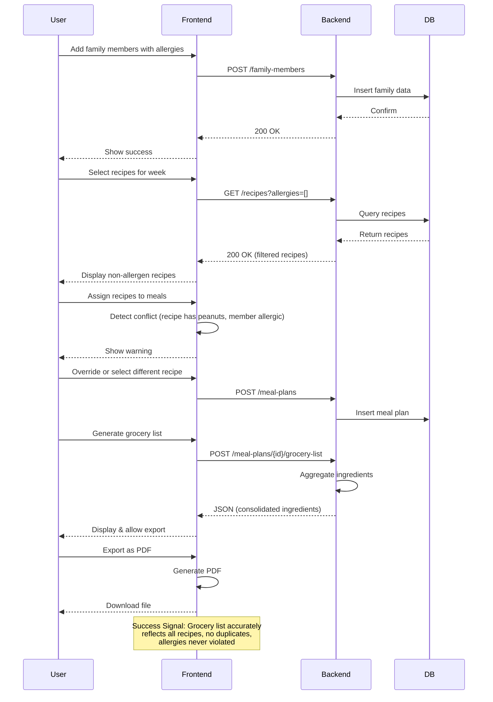

# Family Recipe Planner - Task Breakdown

**Last Updated**: 2026-05-10

## 1. Objective & Deliverables

### Overall Objective
Build a web application that allows families to plan weekly meals (breakfast, lunch, dinner) for multiple family members with different food preferences and allergies, then auto-generate a grocery list.

### Key Deliverables
1. **Web Application** – Responsive UI for meal planning
2. **Recipe Database** – Recipes with ingredients, allergies, and dietary tags
3. **Family Profile Management** – Define family members with preferences and allergies
4. **Weekly Meal Planner** – UI to assign recipes to family members for each meal/day
5. **Grocery List Generator** – Aggregate ingredients from selected recipes with quantity consolidation
6. **Print Interface** – Generate printable recipe cards and grocery list
7. **Data Persistence** – Store recipes, family profiles, and meal plans

---

## 2. Work Hierarchy Breakdown

### Body of Work: Family Recipe Planner Application

#### Feature 1: Family Profile Management
- **Task 1.1**: Create family member data model (name, allergies, preferences, dietary restrictions)
- **Task 1.2**: Build UI form to add/edit family members
- **Task 1.3**: Add allergy/preference tagging system
- **Task 1.4**: Persist family profiles to local storage or database
- **Work Item 1.4.1**: Create migration for family profile schema
- **Work Item 1.4.2**: Implement CRUD endpoints for family members

#### Feature 2: Recipe Management
- **Task 2.1**: Design recipe data model (name, ingredients, instructions, allergies, prep time, dietary tags)
- **Task 2.2**: Build recipe database using Ollama for local generation
  - **Work Item 2.2.1**: Create recipe generation prompt template (JSON structure: name, ingredients with units, instructions, prep time, allergies, dietary tags, serves)
  - **Work Item 2.2.2**: Implement Ollama API client to batch-generate 50+ seed recipes
  - **Work Item 2.2.3**: Validate generated recipes (schema compliance, quality checks) and store to database
  - **Work Item 2.2.4**: Create admin CLI tool to regenerate/refresh recipes on-demand
- **Task 2.3**: Create recipe card UI component
- **Task 2.4**: Implement recipe filtering by allergies and preferences
- **Work Item 2.4.1**: Add search/filter UI
- **Work Item 2.4.2**: Implement server-side filtering logic

#### Feature 3: Weekly Meal Planner
- **Task 3.1**: Design meal plan data model (7 days × 3 meals × family members)
- **Task 3.2**: Build calendar/grid UI for meal assignment
- **Task 3.3**: Implement drag-and-drop or dropdown recipe selection
- **Task 3.4**: Add conflict detection (recipe violates member's allergies)
- **Task 3.5**: Persist meal plans to database
- **Work Item 3.5.1**: Create meal plan schema
- **Work Item 3.5.2**: Implement meal plan CRUD endpoints

#### Feature 4: Grocery List Generation
- **Task 4.1**: Implement ingredient aggregation logic (combine all recipes in meal plan)
- **Task 4.2**: Consolidate duplicate ingredients and sum quantities
- **Task 4.3**: Add grocery list UI with categorization (produce, dairy, meat, etc.)
- **Task 4.4**: Allow manual editing of grocery list (add/remove/modify quantities)
- **Task 4.5**: Implement export to common formats (CSV, PDF, plain text)

#### Feature 5: Print & Export
- **Task 5.1**: Design printable recipe card template
- **Task 5.2**: Design printable grocery list template
- **Task 5.3**: Implement print-to-PDF functionality
- **Task 5.4**: Add print styles for responsive layout
- **Work Item 5.4.1**: Create CSS print media queries

#### Feature 6: Core Infrastructure
- **Task 6.1**: Set up project scaffolding (frontend + backend)
- **Task 6.2**: Configure database and migrations
- **Task 6.3**: Set up authentication (optional: basic login, or start with no auth)
- **Task 6.4**: Implement error handling and logging
- **Task 6.5**: Configure deployment pipeline (staging and production)

---

## 3. Prioritization

### High Priority (Critical Path)
1. **Feature 6**: Core Infrastructure – blocks all other features
2. **Feature 1**: Family Profile Management – needed before meal planning
3. **Feature 2**: Recipe Management – needed before meal planning
4. **Feature 3**: Weekly Meal Planner – core feature, high user impact
5. **Feature 4**: Grocery List Generation – primary value proposition

### Medium Priority
6. **Feature 5**: Print & Export – enhances usability but not blocking

### Implementation Order
1. Weeks 1-2: Feature 6 (infrastructure) + Feature 1 (family profiles)
2. Weeks 2-3: Feature 2 (recipes) + start Feature 3 (planner)
3. Weeks 3-4: Complete Feature 3 + Feature 4 (grocery list)
4. Weeks 4-5: Feature 5 (print/export) + polish & QA

---

## 4. Testing Strategy

### Work Item Level
- **Unit Tests**: Test ingredient aggregation logic, allergy conflict detection, quantity consolidation
- **Example**: `test_aggregate_ingredients_combines_duplicates.py`

### Task Level
- **Component Tests**: Verify form validation, UI state management
- **Example**: Test that adding a member with no allergies displays correctly
- **Definition of Done**: All critical paths tested, no regressions

### Feature Level
- **Integration Tests**: End-to-end flow (create family → add recipes → plan week → generate grocery list)
- **Definition of Done**: Feature works in isolation; passes QA checklist

### Body of Work Level
- **User Acceptance Testing (UAT)**: Real family uses the app to plan a week
- **Definition of Done**: Can complete a week plan, print grocery list, no critical bugs

### Testing Tools
- **Frontend**: Jest, React Testing Library (or equivalent)
- **Backend**: pytest, unittest
- **E2E**: Playwright or Cypress
- **Load Testing**: k6 or Apache JMeter (optional, for scaling)

---

## 5. Observability & Behavior

### Success Signals

#### Feature 1: Family Profile Management
- **Observability**: Log when family members are added, deleted, or modified; track total members in system
- **Expected Behavior**: User adds 5 family members, each with 0-3 allergies; saves and retrieves correctly

#### Feature 2: Recipe Management
- **Observability**: Log recipe searches, filters applied, recipe views
- **Expected Behavior**: User searches "gluten-free" → app shows only recipes tagged as gluten-free

#### Feature 3: Weekly Meal Planner
- **Observability**: Log meal plan creations, edits, conflicts detected; track plan completeness (meals filled)
- **Expected Behavior**: User assigns recipes to 7 days × 3 meals with no conflicts; system warns if recipe contains allergens for that member

#### Feature 4: Grocery List
- **Observability**: Log grocery list generation count, exports; track list accuracy (ingredient count, quantity correctness)
- **Expected Behavior**: User generates list for 5 members' weekly meals → app combines 15 recipes into consolidated ingredient list; quantities are summed correctly

#### Feature 5: Print & Export
- **Observability**: Log export formats used (PDF, CSV, etc.); track print success/failure
- **Expected Behavior**: User clicks "Export as PDF" → downloads correctly formatted document with recipes and grocery list

---

## 6. Dependencies & Constraints

### Technical Dependencies
- **Frontend**: React/Vue/Svelte (your choice), responsive CSS framework
- **Backend**: Node.js (Express/Fastify) OR Python (Flask/Django) OR other
- **Database**: PostgreSQL, MySQL, or SQLite (for MVP)
- **Authentication**: Optional for MVP (can add later)
- **PDF Generation**: pdfkit, puppeteer, or similar
- **Ollama**: Local LLM for recipe generation (Mistral, Llama 2, or equivalent; ~7-13B parameters recommended)
- **JSON Schema Validation**: Ensure Ollama output matches recipe structure

### External Dependencies
- None required for MVP (no API calls to external services)

### Resource Constraints
- **Time**: ~4-6 weeks (solo developer)
- **Scope**: Start with no authentication; add multi-user/cloud sync later

### Known Unknowns (Spikes)
- [ ] **Spike 1**: Decide on tech stack (frontend framework, backend, database)
- [ ] **Spike 2**: Research PDF generation library for recipe cards and grocery lists
- [ ] **Spike 3**: Determine data schema for recipes (how to represent ingredients with units: cups, grams, etc.)
- [ ] **Spike 4**: Evaluate Ollama models (Mistral vs Llama 2 vs others) for recipe quality vs. speed trade-off
- [ ] **Spike 5**: Design recipe generation prompt to ensure consistent JSON output and allergy accuracy
- [ ] **Spike 6**: Determine if recipes should be generated on startup or pre-generated and seeded to database

### Blockers
- None identified for MVP

---

## 7. Security & Compliance

### Mini Threat Model

| Threat | Risk | Control |
|--------|------|---------|
| Unauthorized access to family data | Medium | Start with no auth; add login/password later |
| Data loss (meal plans, recipes) | High | Regular backups; use proper database |
| Allergies incorrectly assigned | Critical | Validation tests; UI confirmation on allergy assignment |
| Recipe contains hidden allergen | Medium | User verification of recipes before saving; comment field for notes |

### Required Security Controls
1. **Input Validation**: Sanitize all recipe/family data inputs
2. **Data Validation**: Ensure allergies are always checked before meal plan generation
3. **Backup Strategy**: Regular database backups (daily for production)
4. **Audit Logging**: Log all changes to family profiles and allergies
5. **Future**: Implement user authentication and role-based access (post-MVP)

---

## 8. Definition of Done (DoD)

### Feature 1: Family Profile Management
- [ ] Add/edit/delete family members
- [ ] Assign allergies and preferences to members
- [ ] Persist data across browser sessions
- [ ] UI is responsive on mobile and desktop
- [ ] Unit tests pass (90%+ coverage)
- [ ] No console errors or warnings

### Feature 2: Recipe Management
- [ ] Recipe database seeded with 20+ starter recipes
- [ ] Search and filter by dietary tags and allergies
- [ ] Recipes display with ingredients, instructions, allergies
- [ ] Add/edit/delete recipes (optional for MVP)
- [ ] Integration tests pass
- [ ] Recipe data model supports metric and imperial units

### Feature 3: Weekly Meal Planner
- [ ] 7-day × 3-meal grid UI
- [ ] Assign recipes to meals per family member (or shared meals)
- [ ] Real-time allergy conflict detection with warnings
- [ ] Meal plan persists to database
- [ ] Load existing meal plans
- [ ] E2E tests pass (happy path: create → assign → generate list)

### Feature 4: Grocery List Generation
- [ ] Aggregate all ingredients from selected recipes
- [ ] Sum quantities for duplicate ingredients
- [ ] Display with category grouping (produce, dairy, meat, pantry)
- [ ] Allow manual editing
- [ ] Export to CSV and PDF
- [ ] Integration tests verify accuracy of aggregation

### Feature 5: Print & Export
- [ ] Printable recipe cards (name, ingredients, instructions, serves X, allergies)
- [ ] Printable grocery list (organized by category, with checkboxes)
- [ ] PDF export works in all major browsers
- [ ] Print styles optimized for A4/Letter paper
- [ ] UI tests verify print layout

### Body of Work
- [ ] All features deployed to staging environment
- [ ] UAT passed with at least one real family (or yourself)
- [ ] Documentation complete (README, setup instructions)
- [ ] No critical bugs
- [ ] Performance acceptable (page load < 2s)

---

## 9. Visual Hierarchy (Mermaid)

```mermaid
graph TD
    BOW["Body of Work<br/>Family Recipe Planner"]
    
    BOW --> F1["Feature 1<br/>Family Profile Mgmt"]
    BOW --> F2["Feature 2<br/>Recipe Management"]
    BOW --> F3["Feature 3<br/>Weekly Meal Planner"]
    BOW --> F4["Feature 4<br/>Grocery List Gen"]
    BOW --> F5["Feature 5<br/>Print & Export"]
    BOW --> F6["Feature 6<br/>Infrastructure"]
    
    F1 --> T1_1["Task 1.1<br/>Data Model"]
    F1 --> T1_2["Task 1.2<br/>UI Form"]
    F1 --> T1_3["Task 1.3<br/>Tagging System"]
    F1 --> T1_4["Task 1.4<br/>Persistence"]
    
    T1_4 --> W1_4_1["WI 1.4.1<br/>DB Schema"]
    T1_4 --> W1_4_2["WI 1.4.2<br/>CRUD Endpoints"]
    
    F3 --> T3_1["Task 3.1<br/>Data Model"]
    F3 --> T3_2["Task 3.2<br/>Calendar UI"]
    F3 --> T3_3["Task 3.3<br/>Recipe Selection"]
    F3 --> T3_4["Task 3.4<br/>Conflict Detection"]
    F3 --> T3_5["Task 3.5<br/>Persistence"]
    
    F4 --> T4_1["Task 4.1<br/>Aggregation Logic"]
    F4 --> T4_2["Task 4.2<br/>Consolidation"]
    F4 --> T4_3["Task 4.3<br/>UI & Categorization"]
    F4 --> T4_4["Task 4.4<br/>Manual Editing"]
    F4 --> T4_5["Task 4.5<br/>Export Formats"]
    
    F6 --> T6_1["Task 6.1<br/>Scaffolding"]
    F6 --> T6_2["Task 6.2<br/>Database Setup"]
    F6 --> T6_3["Task 6.3<br/>Auth Optional"]
    
    style F1 fill:#e1f5ff
    style F2 fill:#e1f5ff
    style F3 fill:#e1f5ff
    style F4 fill:#e1f5ff
    style F5 fill:#fff3e0
    style F6 fill:#f3e5f5
```

### Legend
- **Purple**: Infrastructure (Foundation)
- **Blue**: Core Features (High Priority)
- **Orange**: Polish (Medium Priority)
- **Testing Path**: Work Items → Tasks → Features → Body of Work (bottom-up validation)

---

## 10. Observability Flow

---

## 11. Artifact Storage & Iteration

**Location**: `.continue/plans/task_breakdown.md` (this file)

### Iteration Log
- **v1** (2026-05-10): Initial breakdown from user requirements
- **v2** (2026-05-10): Added Ollama for local recipe generation; updated Feature 2 with recipe generation workflow
- **v3** (TBD): Update after spike completion and tech stack decision

### How to Update This Plan
1. As tasks complete, mark them in the hierarchy
2. If scope changes, update Features and Tasks
3. If timeline adjusts, update Prioritization section
4. Add new risks/unknowns to Dependencies & Constraints
5. Update Definition of Done as acceptance criteria evolve

---

## Next Steps

1. **Immediately**: 
   - Review tech stack (frontend, backend, database choices)
   - Decide on Ollama model (Mistral vs Llama 2 for recipe quality/speed)
2. **This week**: Complete Spikes 1-6 above, including Ollama prompt design
3. **Next week**: Start Feature 6 (infrastructure setup) + Task 2.2 (Ollama recipe generation)
4. **Then**: Proceed with remaining features in priority order

---

**Prepared by**: GitHub Copilot  
**Scope**: MVP (Minimum Viable Product)  
**Estimated Duration**: 4-6 weeks (solo development)
